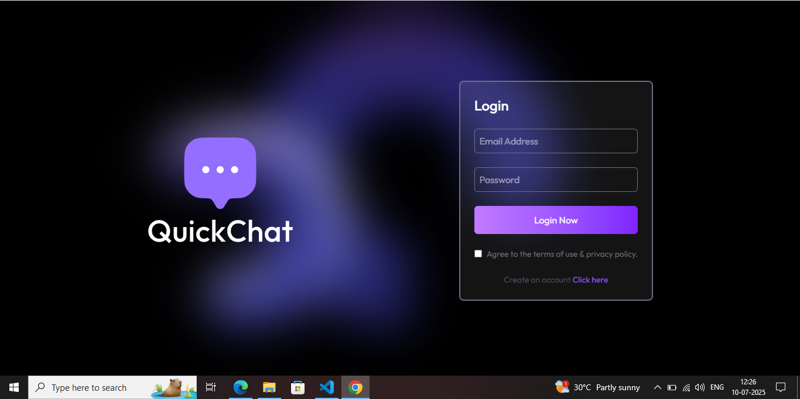
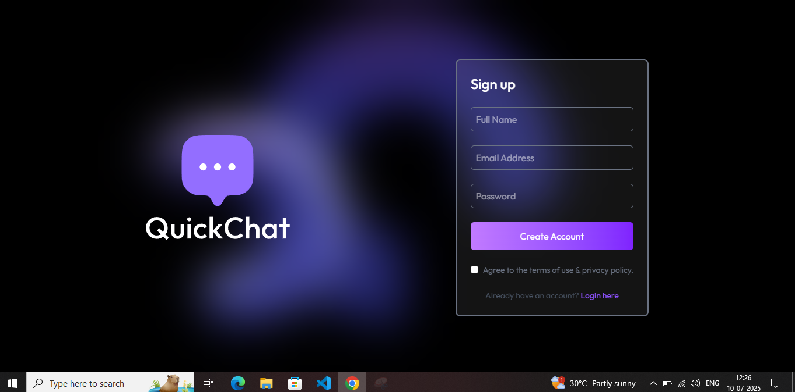
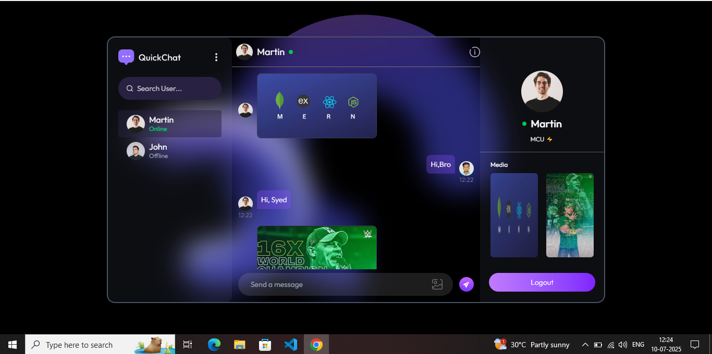
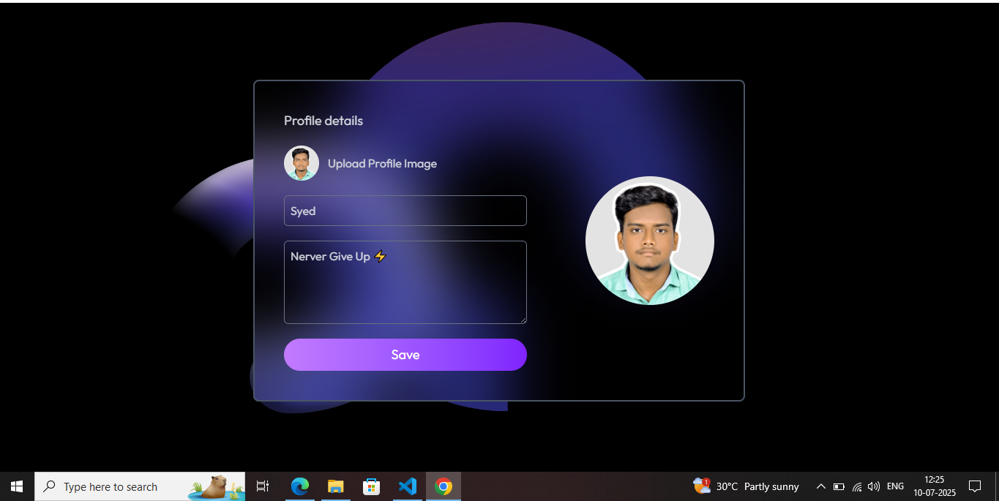

# 💬 MERN Chat App

A real-time chat application built with the **MERN stack** (MongoDB, Express, React, Node.js) and **Socket.IO** for live messaging. Users can register, login, update their profiles, and chat with others in real-time with image support and online presence detection.

---

## 🚀 Features

- 🔐 User Authentication (JWT + Cookies)
- 💬 Real-time Messaging (Socket.IO)
- 🧑‍🤝‍🧑 Online Users Detection
- 📷 Image Uploads (Cloudinary)
- 👤 Profile Editing (name, bio, profile pic)
- 🌐 Mobile-Responsive UI
- 🗂️ Clean Folder Structure with Context API

---

## 🛠️ Tech Stack

| Tech        | Description                  |
|-------------|------------------------------|
| **Frontend**| React, Tailwind CSS, Axios   |
| **Backend** | Node.js, Express, Socket.IO  |
| **Database**| MongoDB Atlas (Mongoose)     |
| **Auth**    | JWT + HTTPOnly Cookies       |
| **Image CDN** | Cloudinary                |

---

## 📸 Screenshots

### Login Page


### Register Page


### Home Page


### Update Profile


---

## 📦 Getting Started

### 1️⃣ Clone the Repository

```bash
# 1. Clont The Repo
git clone https://github.com/syedthedev/mern-chat-app.git
cd mern-chat-app

# 2. Backend
cd Server
npm install
node Server.js

# 3. Frontend
cd Client
npm run dev
